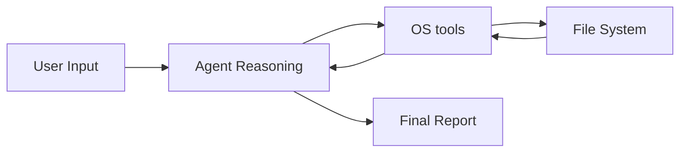

# Practice Agent: File Metadata Organizer

The File Metadata Organizer is an agent designed to interact with the local file system. It demonstrates how agents can bridge the gap between abstract reasoning and concrete operating system interactions.

## System Architecture

The agent performs the following steps:
1. Receives a user request regarding local files.
2. Identifies if it needs to list files or inspect a specific file.
3. Executes the corresponding tool (list_files or get_file_metadata).
4. Analyzes the tool results to provide a human-readable summary.

## Logic Flow Diagram

## How to Run

1. Navigate to the project directory:
   cd practice/file-organizer

2. Configure your API keys in the root .env file.

3. Run the agent:
   uv run main.py

## Examples

Example 1: List Files
Input: What files are in this folder?
Output: Agent: The files in the current folder are: main.py, agent.py, tools.py, memory.py, README.md.

Example 2: File Details
Input: Tell me about main.py
Output: Agent: File main.py has a size of 2048 bytes and was last modified on 2026-04-20 20:10:00.

## Key Learning Outcomes

- OS Integration: Learning how to provide agents with read access to the local machine.
- Security and Scope: Understanding why tools should be specific (e.g. list_files) rather than providing a generic shell access.
- Metadata Processing: Observing how agents handle raw system data and format it for users.
