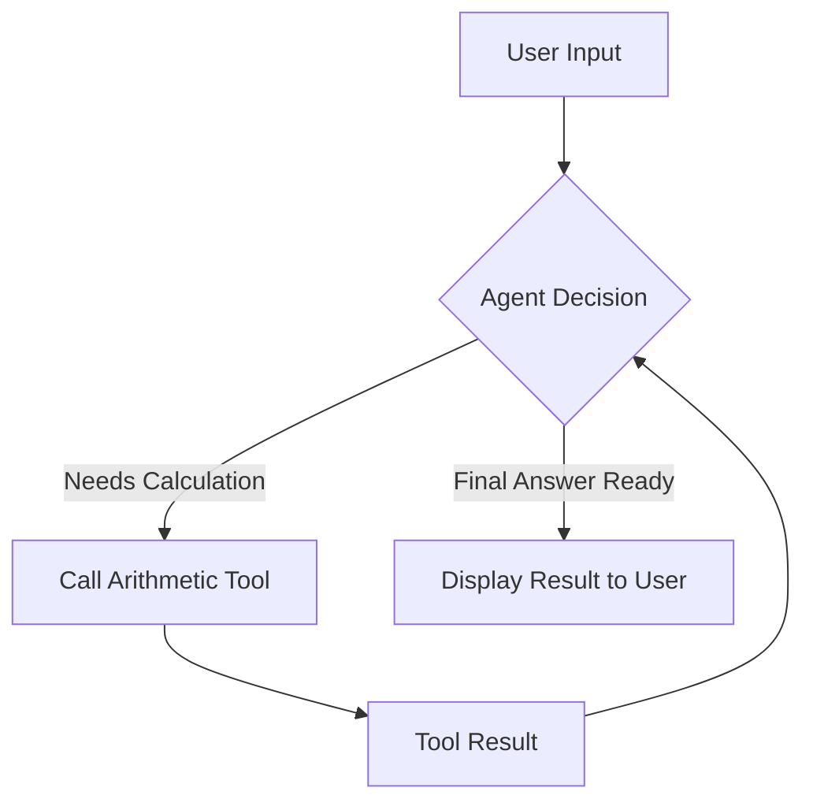

# Practice Agent: Smart Calculator

This project demonstrates a basic agentic system designed for deterministic mathematical tasks. While LLMs can often hallucinate numbers, this agent uses discrete arithmetic tools to ensure perfect accuracy.

## System Architecture

The agent follows a standard loop:
1. Receive mathematical query from the user.
2. Formulate a plan and identify the necessary arithmetic operation.
3. Call the appropriate tool (add, subtract, multiply, or divide).
4. Integrate the tool output into the final response to the user.

## Logic Flow Diagram

## How to Run

1. Navigate to the project directory:
   cd practice/smart-calculator

2. Configure your API keys in the root .env file.

3. Run the agent:
   uv run main.py

## Examples

Example 1: Basic Addition
Input: Add 15 and 25
Output: Result: 40.0

Example 2: Complex Calculation
Input: Multiply 10 by (5 + 5)
Output: Result: 100.0

## Key Learning Outcomes

- Deterministic Logic: Understanding when an agent should rely on tools instead of internal reasoning.
- Multi-Step Reasoning: Observing the agent handle nested operations like (10 + 20) / 2.
- Tool Isolation: Seeing how each arithmetic function is encapsulated as a standalone tool.
